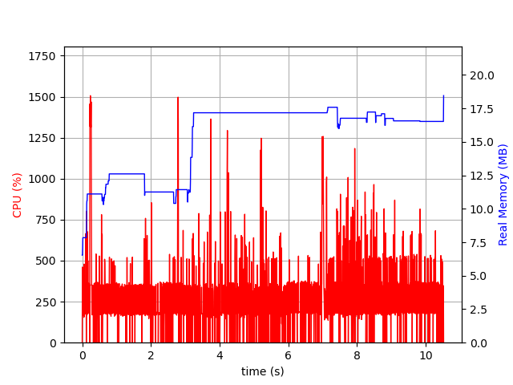
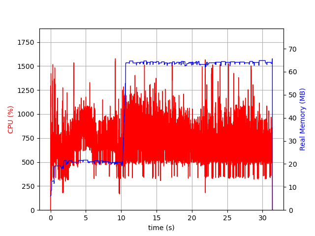
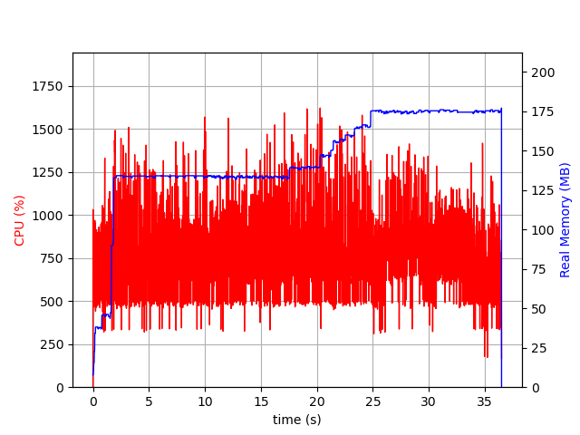
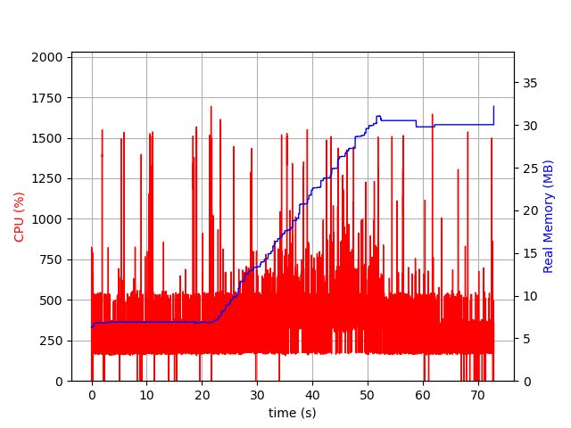

# Unix Recursive


Blazingly fast functions for recursive file system operations.
Utilizing lazy IO for constant space & computation efficiant bindigns to Posix [`dirstream.h`](https://sourceware.org/git/?p=glibc.git;a=blob;f=sysdeps/unix/dirstream.h;h=8303f07fab6f6efaa39e51411ef924e712d995e0;hb=fa39685d5c7df2502213418bead44e9543a9b9ec) api.

## Comparision with other libraries:

Tests were performed on relatively modern consumer grade HW with relatively modern consumer grade M.2 SSD drive.
All done on binaries compiled with optimization that are listing the same directory
with 1,705,184 items.

### [this lib] Unix Recursive `RawFilePath`/ByteString



- [source](bin/unix-recursive-bytestring.hs)

### [this lib] Unix Recursive `FilePath`/String



- [source](bin/unix-recursive-string.hs)

### [alternative] Dir Traverse (`FilePath`/String is the only option)



- [source](bin/dir-traverse.hs)
- [lib](https://hackage.haskell.org/package/dir-traverse)

### [alternative] Dirstream (`Filesystem.Path` is the only option)



- [source](bin/dirstream.hs)
- [lib](https://hackage.haskell.org/package/dirstream)

## Testing performance

Cabal flag `bin` is being used for building the example binaries that can be used for measurement.

```
make bin
```

or to build and run one of the binaries:

```
$ stack build --flag unix-recursive:bin --exec "unix-recursive-bytestring-bin ${path-to-directory}"
```

## Hacking

This project uses the "Perfect Haskell Preprocessor" (PHP) for generating haskell source from meta module hs.
See [`gen`](gen) directory and [`MakeFile`](MakeFile) before you start hackking on stuff.
